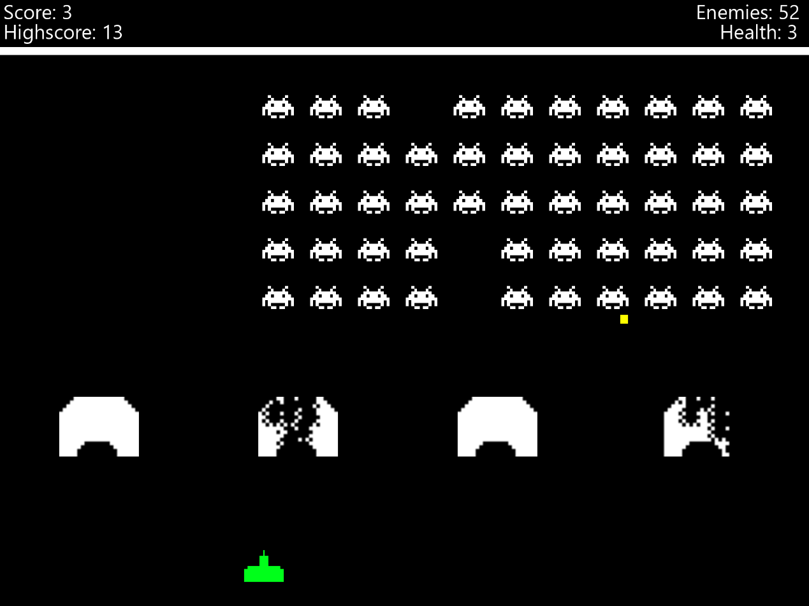

# Space Invaders implemented in Java
Space Invaders is a very known arcade game created in 1978. This respository contains a functional implementation of the game in Java.

Features:
- the player gets to play against 55 enemy ships, the ships get faster as they move closer to the surface
- the player has 3 lives, whenever an enemy shot hits him he loses one of his lives, if the player gets hit three times or the enemy ships move too close to the surface the player loses the game
- the player's remaining lives as well as the number of remaining enemy ships is shown at the top of the screen
- the player can hit enemy ships by pressing SPACE, whenever he hits one the enemy ship gets destroyed and the player's score count increases by one
- the player's scores are saved into the score.txt file that's stored in the game's root directory, both the current score and the player's high score are shown at the top of the screen
- there are 4 barriers between the player and the enemy ships, each barrier has 4 lives and loses one life upon impact with any type of hit (meaning that the player can damage the barrier just as the enemy ships can)
- if the player manages to destroy all enemy ships in time, he reaches next level in which his ship is along with every barrier brought to full health, the enemy ships move slightly faster as the level count increases

